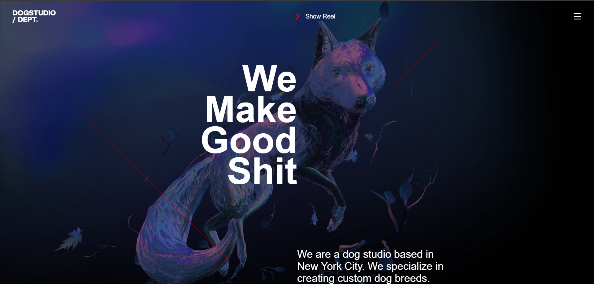

<div align="center">

# 🐶 Dogstudio Landing – 3D React Clone

A small but punchy clone-inspired landing experience of Dogstudio, built with  
React, Vite, Three.js, React Three Fiber, GSAP, and custom matcap shaders.

</div>

---

## 📷 Screenshots / Demo

> Demo: Check out the live demo [here](https://mayurk224.github.io/dogStudio_clone/).

```md

```

---

## ✨ Features

- 3D dog model rendered with Three.js + React Three Fiber
- Custom matcap shader transition on the dog and branches
- Scroll-driven camera and model animation powered by GSAP ScrollTrigger
- Hover-driven color / matcap transitions mapped to project titles
- Modern Vite-based React setup with fast HMR

---

## 🚀 Tech Stack

- **Framework**: React + Vite
- **3D / WebGL**: Three.js, @react-three/fiber, @react-three/drei
- **Animation**: GSAP, @gsap/react, ScrollTrigger
- **Language**: JavaScript (ESM)

---

## 📦 Getting Started

Clone the repo and install dependencies:

```bash
git clone https://github.com/YOUR_USERNAME/dogstudio-clone.git
cd dogstudio-clone
npm install
```

### Development

```bash
npm run dev
```

Then open the printed local URL (usually `http://localhost:5173`) in your browser.

### Production Build

```bash
npm run build
```

To preview the production build:

```bash
npm run preview
```

---

## 🧠 Project Structure

Key files and folders:

- `src/main.jsx` – React entry point
- `src/App.jsx` – Main layout / sections
- `src/components/Dog.jsx` – 3D dog + branches scene, shaders, and animations
- `public/models/dog.drc.glb` – Compressed dog model
- `public/matcap/*.png` – Matcap textures used by the custom shader
- `public/*` – Normal maps and project thumbnails

---

## 🎨 3D & Shader Highlights

- Uses `useGLTF` to load the dog model and `useAnimations` to play its idle animation.
- Applies a **custom matcap blending shader** via `onBeforeCompile`, injecting uniforms:
  - `uMatcapTexture1`, `uMatcapTexture2` – two matcaps to blend between
  - `uProgress` – controls the smooth transition between matcaps
- ScrollTrigger-driven GSAP timeline moves/rotates the scene as you scroll between sections.
- Hovering the project titles updates the matcap uniforms, creating interactive visual feedback.

---

## 🛠️ Scripts

From `package.json`:

- `npm run dev` – Start dev server
- `npm run build` – Build for production
- `npm run preview` – Preview production build
- `npm run lint` – Run ESLint over the project

---

## 🤝 Credits

- Original design & inspiration: **Dogstudio®** (this is a **fan-made clone**, not affiliated).
- Built with love using React, Three.js, GSAP, and Vite.

---

## 📄 License

This project is for learning and portfolio purposes.  
Check the original Dogstudio website before using this commercially.
